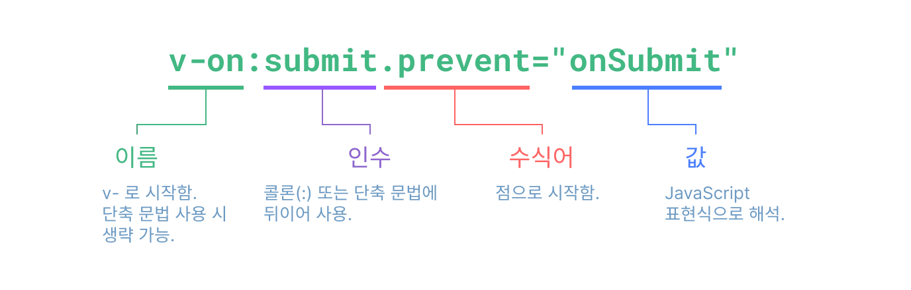

# Template Syntax

- 텍스트 보간법

  데이터 바인딩의 가장 기본적인 형태는 "Mustache"(이중 중괄호) 문법이다.

  ```
  <span>메세지: {{ msg }}</span>
  ```

- 속성 바인딩

  v-bind 를 사용한다.

  ```
  //기본형태
  <div v-bind:id="dynamicId"></div>

  //단축 가능
  <div :id="dynamicId"></div>

  // 여러 속성 객체 형태로 전달 가능
  const objectOfAttrs = {
    id: 'container',
    class: 'wrapper'
  }

  <div v-bind="objectOfAttrs"></div>
  ```

- 함수 호출
  쌍 따옴표로 함수 호출 가능

  ```
  <time :title="toTitleDate(date)" :datetime="date">
    {{ formatDate(date) }}
  </time>
  ```

- v-if

  v-if에 넘겨주는 값에 따라 요소의 삽입 또는 제거 할 수 있음

  ```
      <p v-if="seen">이제 이것을 볼 수 있습니다.</p>
  ```

- 인자

  일부 디렉티브는 콜론을 붙여 속성을 적용할 수 있다.

  ```
    // a태그의 href 속성 적용 예시
    <a v-bind:href="url"> ... </a>

    // 단축
    <a :href="url"> ... </a>
  ```

- 동적인 인자

  동적인 인자는 대괄호로 표현 가능하고, null 또는 문자열로 작성 가능.
  null일 경우 바인딩을 명시적으로 제거.
  또한, dom 내 템플릿을 사용할 때 브라우저가 속성 이름을 소문자로 강제 변환하므로 대문자로 키 이름을 지정하지 않는다.

  ```
    <a v-on:[eventName]="doSomething"> ... </a>

    // 단축
    <a @[eventName]="doSomething"> ... </a>

  ```

- 수식어

  수식어는 점(.)으로 시작하는 특수한 접미사로, 디렉티브가 특별한 방식으로 바인딩되어야 함을 나타냅 예를 들어 .prevent 수식어는 트리거된 이벤트에서 event.preventDefault()를 호출하도록 v-on 디렉티브에 지시

  ```
      <form @submit.prevent="onSubmit">...</form>
  ```

- 디렉토리 문법 정리 이미지
  
